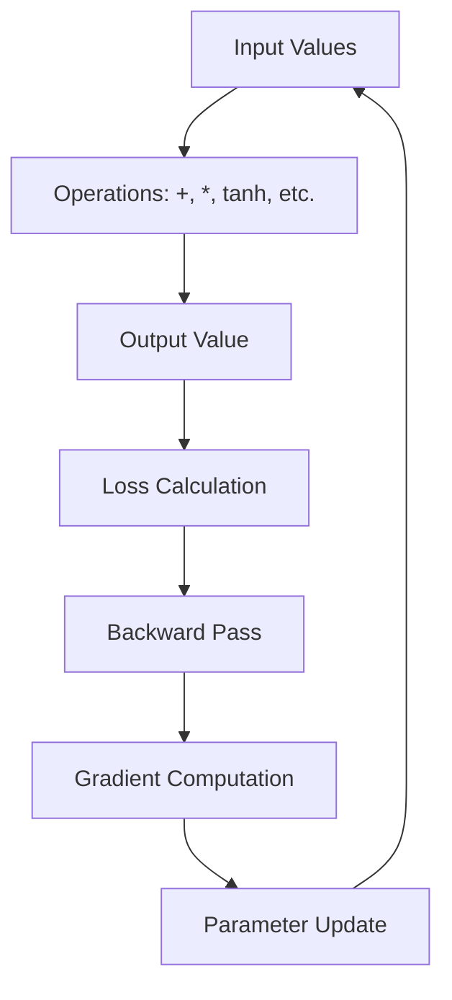
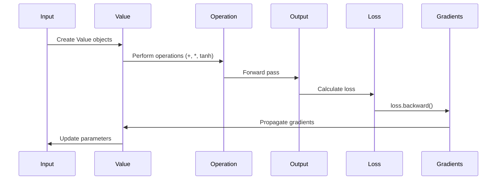
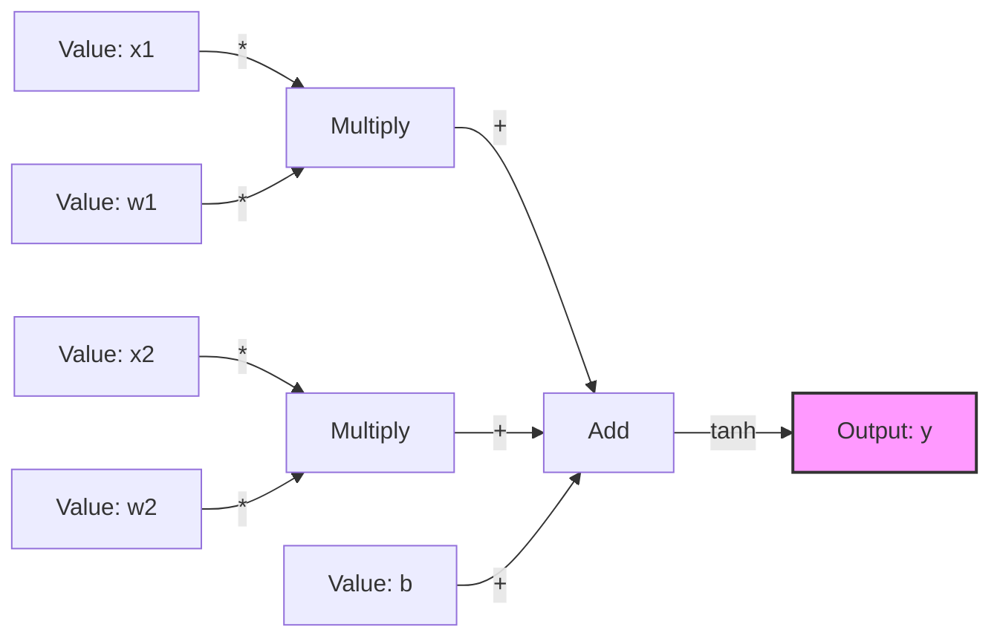
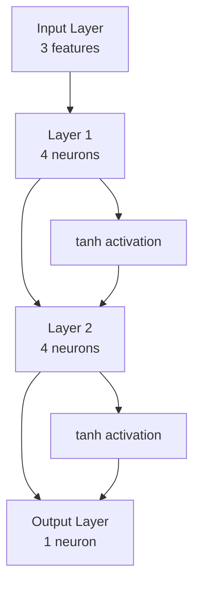

# Micrograd

A tiny autograd engine implementing automatic differentiation in pure Python. This project demonstrates the fundamental concepts behind neural networks and backpropagation by building a minimal deep learning framework from scratch.

## 🎯 Overview

Micrograd is a lightweight implementation of automatic differentiation that allows you to:
- Build computation graphs dynamically
- Perform forward and backward passes
- Train neural networks using gradient descent
- Visualize computation graphs

This project serves as an educational tool to understand how modern deep learning frameworks (like PyTorch, TensorFlow) work under the hood.

## ✨ Features

- **Automatic Differentiation**: Automatic gradient computation using reverse-mode autodiff
- **Neural Network Components**: Implementation of neurons, layers, and multi-layer perceptrons (MLPs)
- **Computation Graph Visualization**: Generate visual representations of computation graphs using Graphviz
- **Pure Python**: No external dependencies for the core engine (only for visualization)

## 📁 Project Structure

```
Micrograd/
├── src/
│   ├── engine.py      # Core Value class with autograd engine
│   ├── nn.py          # Neural network components (Neuron, Layer, MLP)
│   └── demo.py        # Examples and visualization demos
├── main.py            # Training example
├── requirements.txt   # Dependencies
└── README.md         # This file
```

## 🏗️ Architecture

### Core Components

#### 1. Value Class (`engine.py`)
The heart of the autograd engine. Each `Value` object represents a node in the computation graph.

```python
class Value:
    - data: The numerical value
    - grad: The gradient (computed during backward pass)
    - _prev: Children nodes in the computation graph
    - _op: Operation that created this value
    - _backward: Function to compute gradients
```

#### 2. Neural Network Components (`nn.py`)
- **Neuron**: Single neuron with weights, bias, and activation
- **Layer**: Collection of neurons
- **MLP**: Multi-layer perceptron (feedforward neural network)

### Computation Graph Flow



### Forward and Backward Pass



## 🚀 Installation

1. Clone the repository:
```bash
git clone <repository-url>
cd Micrograd
```

2. Create a virtual environment (recommended):
```bash
python -m venv venv
source venv/bin/activate  # On Windows: venv\Scripts\activate
```

3. Install dependencies:
```bash
pip install -r requirements.txt
```

**Note**: For Graphviz visualization, you may need to install Graphviz system package:
- **Windows**: Download from [Graphviz website](https://graphviz.org/download/)
- **macOS**: `brew install graphviz`
- **Linux**: `sudo apt-get install graphviz`

## 💻 Usage

### Basic Example: Simple Computation

```python
from src.engine import Value

# Create values
a = Value(2.0, label='a')
b = Value(3.0, label='b')
c = a * b + 10

# Compute gradients
c.backward()

print(f"c.data: {c.data}")  # Output: 16.0
print(f"a.grad: {a.grad}")  # Output: 3.0
print(f"b.grad: {b.grad}")  # Output: 2.0
```

### Neural Network Example

```python
from src.nn import MLP

# Create a multi-layer perceptron
# Input: 3 features, Hidden: [4, 4], Output: 1
model = MLP(3, [4, 4, 1])

# Training data
xs = [
    [2.0, 3.0, -1.0],
    [3.0, -1.0, 0.5],
    [0.5, 1.0, 1.0],
    [1.0, 1.0, -1.0]
]
ys = [1.0, -1.0, -1.0, 1.0]

# Training loop
for epoch in range(100):
    # Forward pass
    ypred = [model(x) for x in xs]
    
    # Loss calculation
    loss = sum([(yout - ygt)**2 for ygt, yout in zip(ys, ypred)])
    
    # Backward pass
    for p in model.parameters():
        p.grad = 0.0
    loss.backward()
    
    # Update parameters
    for p in model.parameters():
        p.data += -0.01 * p.grad
    
    print(f"Epoch {epoch+1} | Loss: {loss.data:.4f}")
```

### Visualization

Run the demo to see computation graph visualization:

```python
python src/demo.py
```

This will generate a `graph_output.svg` file showing the computation graph.

## 🧠 How It Works

### Automatic Differentiation

The engine uses **reverse-mode automatic differentiation** (backpropagation):

1. **Forward Pass**: Operations build a computation graph
2. **Backward Pass**: Gradients are computed by traversing the graph in reverse
3. **Chain Rule**: Each operation defines how to propagate gradients

### Supported Operations

- **Arithmetic**: `+`, `-`, `*`, `/`, `**`
- **Activation Functions**: `tanh()`, `exp()`
- **Composition**: All operations can be chained together

### Gradient Flow Example

For a simple expression `y = (x1*w1 + x2*w2 + b).tanh()`:



During backward pass, gradients flow from `y` back to `x1`, `x2`, `w1`, `w2`, and `b`.

## 📊 Neural Network Architecture

A typical MLP structure:



## 🎓 Learning Resources

This implementation demonstrates:
- **Automatic Differentiation**: How gradients are computed automatically
- **Backpropagation**: The algorithm that makes neural networks trainable
- **Computation Graphs**: How operations are represented as graphs
- **Neural Network Basics**: Building blocks of deep learning

## 📝 Example Output

Running `main.py` will show training progress:

```
Iteration 001 | Loss: 2.3456 | Total Parameters: 41
Iteration 002 | Loss: 2.1234 | Total Parameters: 41
Iteration 003 | Loss: 1.9876 | Total Parameters: 41
...
Iteration 100 | Loss: 0.0123 | Total Parameters: 41
```

## 🤝 Contributing

This is an educational project. Feel free to:
- Experiment with different architectures
- Add new activation functions
- Implement additional optimizers
- Create more visualization examples

## 📄 License

This project is for educational purposes.

## 🙏 Acknowledgments

This project is based on **Andrej Karpathy's micrograd** - a brilliant educational implementation of automatic differentiation. The original micrograd repository can be found at [karpathy/micrograd](https://github.com/karpathy/micrograd).

Special thanks to **Andrej Karpathy** for creating the original micrograd and for his excellent educational content on neural networks and deep learning.

## 📺 Video Tutorial

This implementation was created as a code-along following Andrej Karpathy's excellent tutorial:

**🎥 [The spelled-out intro to neural networks and backpropagation: building micrograd](https://youtu.be/VMj-3S1tku0?si=FT-jtfBsT6xjbyYk)**

The video provides an in-depth explanation of:
- How neural networks work from scratch
- The mathematics behind backpropagation
- Building an autograd engine step by step
- Training neural networks using gradient descent

Highly recommended for anyone wanting to understand the fundamentals of deep learning!

---

**Happy Learning! 🚀**

